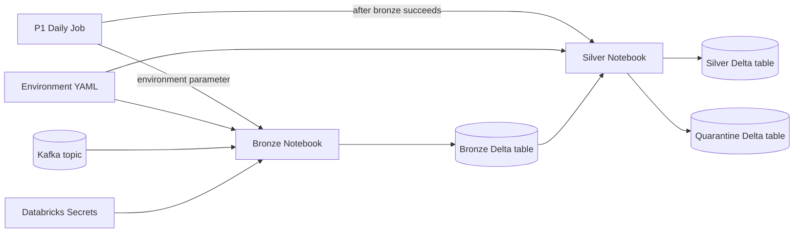

# P1 Component Dependencies

## Dependency Matrix

| Consumer | Dependency | Relationship / communication |
|---|---|---|
| P1 Daily Job | Bronze Ingestion Notebook | Invokes as the first notebook task and passes `environment`. |
| P1 Daily Job | Silver Transformation Notebook | Invokes after successful completion of bronze and passes `environment`. |
| Bronze Ingestion Notebook | Environment Configuration | Independently loads `configs/{environment}.yaml`. |
| Silver Transformation Notebook | Environment Configuration | Independently loads `configs/{environment}.yaml`. |
| Bronze Ingestion Notebook | Kafka topic `my-topic` | Reads new records using configured hosts and runtime secret lookup. |
| Bronze Ingestion Notebook | Bronze Delta table | Writes the source payload and Kafka metadata. |
| Bronze Ingestion Notebook | Databricks Secret Store | Resolves configured secret scope and key at runtime; secret values are not passed through job parameters. |
| Silver Transformation Notebook | Bronze Delta table | Reads persisted records as its input contract. |
| Silver Transformation Notebook | Silver Delta table | Merges expanded, valid events into current state. |
| Silver Transformation Notebook | Quarantine Delta table | Writes malformed records and diagnostic metadata. |

## Data Flow

### Text alternative

The daily job passes an environment parameter to two sequential notebook tasks. Bronze reads Kafka using configuration and a Databricks secret, then writes the bronze Delta table. Silver reads bronze and writes valid current-state records to silver and malformed records to quarantine.
