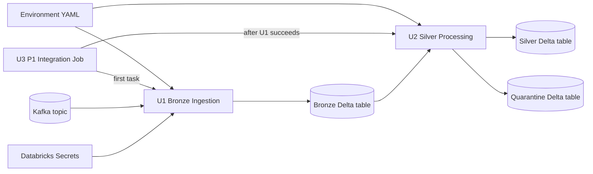

# P1 Unit Dependencies

## Dependency Matrix

| Unit | Depends on | Dependency type | Reason |
|---|---|---|---|
| U1 — Bronze Ingestion | Environment configuration and Kafka/Databricks Secrets | Runtime | Needs Kafka hosts, topic, and runtime secret lookup to ingest events. |
| U2 — Silver Processing and Quarantine | U1 — Bronze Ingestion | Data contract and runtime | Reads the persisted bronze Delta table produced by U1. |
| U2 — Silver Processing and Quarantine | Environment configuration | Runtime | Resolves database and silver/quarantine destinations. |
| U3 — P1 Integration | U1 — Bronze Ingestion | Packaging and orchestration | References the bronze notebook and its task parameters. |
| U3 — P1 Integration | U2 — Silver Processing and Quarantine | Packaging and orchestration | References the silver notebook and its task parameters. |
| U3 — P1 Integration | Environment configuration | Deployment | Supplies the environment name and keeps environment values together. |

## Development Order

1. **U1 — Bronze Ingestion** establishes the bronze table output contract.
2. **U2 — Silver Processing and Quarantine** consumes that contract and establishes silver/quarantine outputs.
3. **U3 — P1 Integration** assembles both notebook tasks, their environment parameter, and the runtime dependency order.

The team may work on U3's static job structure before U1/U2 implementation finishes, but final integration validation depends on both notebook paths and interfaces being stable.

## Runtime Flow

### Text alternative

U3 runs U1 first and then U2 after U1 succeeds. U1 reads Kafka using configuration and a Databricks secret, then writes bronze. U2 reads bronze and writes valid current-state records to silver and malformed records to quarantine. Both notebooks load the environment YAML independently.
