# P1 Execution Plan

## Detailed Analysis Summary

### Transformation Scope

- **Project type**: Greenfield Databricks workload; reverse engineering is not applicable.
- **Transformation type**: New workload, not a change to an existing application.
- **Primary changes**: Add bronze Kafka ingestion, silver JSON transformation and current-state merge, malformed-message quarantine, one daily Databricks job, and configuration use for Kafka, database, and storage.
- **Related components**: `configs/prod.yaml`; `notebooks/P1/bronze/`; `notebooks/P1/silver/`; `notebooks/P1/gold/` (directory only; no gold output); `jobs/P1/`.

### Change Impact Assessment

- **User-facing changes**: Indirect — downstream data engineers query the new silver table.
- **Structural changes**: Yes — new project folders, notebooks, and job definition.
- **Data model changes**: Yes — bronze source records, expanded silver JSON fields, current-state rows by `event_key`, and quarantine records.
- **API changes**: No external API is introduced.
- **NFR impact**: Yes — secret handling, persistent incremental progress, replay/idempotency, malformed-data isolation, and basic observability matter. No numeric throughput or latency target is defined.
- **Current environment configuration**: `configs/prod.yaml` sets database `test_prod`, data path `s3://test_prod`, and Kafka host `test.com:9995` at `kafka.hosts`. Kafka secret key is `my-secret`; its secret scope remains an environment/deployment value.

### Component Relationships

This is a greenfield workload, so there are no existing components or package dependencies to map. The planned runtime flow is:

1. The P1 job runs the bronze ingestion notebook and reads new records from Kafka.
2. Bronze persists each source payload and Kafka metadata, using a durable checkpoint for incremental progress.
3. The silver notebook parses valid JSON and merges the latest record by `event_key`.
4. Malformed messages are written to the quarantine destination and excluded from silver.

### Risk Assessment

- **Risk level**: Moderate — the workload is bounded, but JSON schema and secret-scope details remain open, and checkpointed Kafka progress must stay consistent with Delta writes.
- **Rollback complexity**: Moderate — restoring a prior table state or replaying data requires coordination with the Structured Streaming checkpoint.
- **Testing complexity**: Moderate — verify incremental offsets, retry behavior, latest-event ordering, Delta merge behavior, and malformed-record isolation.

## Workflow Visualization

```mermaid
flowchart TD
    Start([P1 Workload])
    End([Complete])

    subgraph INCEPTION["INCEPTION"]
        WD["Workspace Detection<br/>COMPLETED"]
        RE["Reverse Engineering<br/>SKIP"]
        RA["Requirements Analysis<br/>COMPLETED"]
        US["User Stories<br/>COMPLETED"]
        WP["Workflow Planning<br/>IN PROGRESS"]
        AD["Application Design<br/>EXECUTE"]
        UG["Units Generation<br/>EXECUTE"]
    end

    subgraph CONSTRUCTION["CONSTRUCTION"]
        FD["Functional Design<br/>EXECUTE"]
        NR["NFR Requirements<br/>EXECUTE"]
        ND["NFR Design<br/>EXECUTE"]
        ID["Infrastructure Design<br/>EXECUTE"]
        CG["Code Generation<br/>EXECUTE"]
        BT["Build and Test<br/>EXECUTE"]
    end

    subgraph OPERATIONS["OPERATIONS"]
        OPS["Operations<br/>PLACEHOLDER"]
    end

    Start --> WD --> RE --> RA --> US --> WP --> AD --> UG --> FD --> NR --> ND --> ID --> CG --> BT --> End
    BT -.-> OPS

    style WD fill:#4CAF50,stroke:#1B5E20,stroke-width:3px,color:#fff
    style RA fill:#4CAF50,stroke:#1B5E20,stroke-width:3px,color:#fff
    style US fill:#4CAF50,stroke:#1B5E20,stroke-width:3px,color:#fff
    style CG fill:#4CAF50,stroke:#1B5E20,stroke-width:3px,color:#fff
    style BT fill:#4CAF50,stroke:#1B5E20,stroke-width:3px,color:#fff
    style RE fill:#BDBDBD,stroke:#424242,stroke-width:2px,stroke-dasharray: 5 5,color:#000
    style OPS fill:#BDBDBD,stroke:#424242,stroke-width:2px,stroke-dasharray: 5 5,color:#000
    style WP fill:#FFA726,stroke:#E65100,stroke-width:3px,stroke-dasharray: 5 5,color:#000
    style AD fill:#FFA726,stroke:#E65100,stroke-width:3px,stroke-dasharray: 5 5,color:#000
    style UG fill:#FFA726,stroke:#E65100,stroke-width:3px,stroke-dasharray: 5 5,color:#000
    style FD fill:#FFA726,stroke:#E65100,stroke-width:3px,stroke-dasharray: 5 5,color:#000
    style NR fill:#FFA726,stroke:#E65100,stroke-width:3px,stroke-dasharray: 5 5,color:#000
    style ND fill:#FFA726,stroke:#E65100,stroke-width:3px,stroke-dasharray: 5 5,color:#000
    style ID fill:#FFA726,stroke:#E65100,stroke-width:3px,stroke-dasharray: 5 5,color:#000
    style Start fill:#CE93D8,stroke:#6A1B9A,stroke-width:3px,color:#000
    style End fill:#CE93D8,stroke:#6A1B9A,stroke-width:3px,color:#000
    style INCEPTION fill:#BBDEFB,stroke:#1565C0,stroke-width:3px,color:#000
    style CONSTRUCTION fill:#C8E6C9,stroke:#2E7D32,stroke-width:3px,color:#000
    style OPERATIONS fill:#FFF59D,stroke:#F57F17,stroke-width:3px,color:#000
```

### Text alternative

Workspace Detection, Requirements Analysis, and User Stories are complete. Reverse Engineering is skipped because P1 is greenfield. Workflow Planning is current. The plan is to execute Application Design, Units Generation, Functional Design, NFR Requirements, NFR Design, Infrastructure Design, Code Generation, and Build and Test. Operations remains a future placeholder.

## Phases to Execute

### Inception Phase

- [x] Workspace Detection — completed; no workload source code existed.
- [x] Reverse Engineering — skipped; this is a greenfield workload.
- [x] Requirements Analysis — completed and approved.
- [x] User Stories — completed and approved.
- [x] Workflow Planning — completed and approved.
- [ ] Application Design — EXECUTE. Define the responsibilities and interactions of the Kafka-to-bronze, bronze-to-silver, quarantine, and job components.
- [ ] Units Generation — EXECUTE. Decompose the workload into bronze, silver, job/configuration, and validation units with dependencies.

### Construction Phase

- [ ] Functional Design — EXECUTE. Specify JSON parsing, bronze persistence, latest-event selection and merge by key, and quarantine behavior per unit.
- [ ] NFR Requirements — EXECUTE. Define secret handling, checkpoint/retry expectations, data traceability, and observable job outcomes; record that no numeric performance target is currently known.
- [ ] NFR Design — EXECUTE. Select concrete patterns for durable incremental progress, idempotent writes, malformed-message isolation, and basic logging/metrics.
- [ ] Infrastructure Design — EXECUTE. Map the job, notebooks, Kafka connection, Delta tables, S3 checkpoint/storage paths, and Databricks secret reference to the target Databricks environment.
- [ ] Code Generation — EXECUTE (always). Create Python Databricks notebooks, the P1 Declarative Automation Bundle job definition, and any required environment configuration updates.
- [ ] Build and Test — EXECUTE (always). Validate JSON/YAML and notebook syntax, then test parsing, latest-event merge, incremental behavior, and quarantine handling.

### Operations Phase

- [ ] Operations — PLACEHOLDER. Deployment and ongoing monitoring workflows are not part of the current AI-DLC stages.

## Package Change Sequence

Not applicable; no existing packages or module dependencies were found.

## Estimated Timeline

- **Remaining execution stages after Workflow Planning**: 8.
- **Estimated duration**: Provisional 2–4 engineering days after the complete JSON schema and Databricks secret scope/job environment are available. External environment provisioning and access approvals are excluded.

## Success Criteria

- **Primary goal**: Make the latest valid Kafka event per `event_key` queryable from the P1 silver table after each daily incremental run.
- **Key deliverables**: P1 bronze and silver notebooks, quarantine behavior, Databricks Bundle job definition, environment configuration references, and focused validation coverage.
- **Quality gates**: Requirements and stories approved; design artifacts trace to requirements; no secrets committed; Kafka progress and Delta writes behave safely on retry; malformed messages do not enter silver; all relevant artifact references remain consistent.
