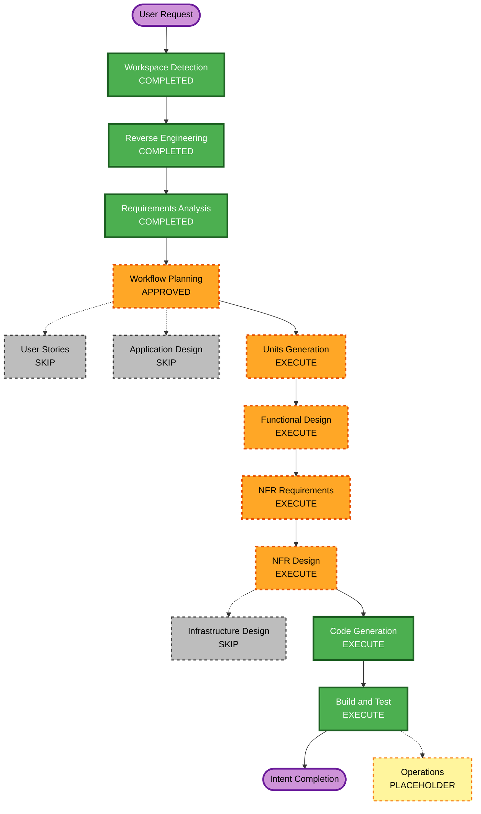

# Execution Plan — P1 Layer Timestamp Columns

## Detailed Analysis Summary

### Transformation Scope

- **Transformation Type**: Brownfield data-schema and notebook behavior enhancement.
- **Primary Changes**: Add `bronze_ingestion_timestamp` to bronze and `silver_processing_timestamp` to silver; generate each at its layer's successful insert/update boundary and migrate existing table schemas additively.
- **Related Components**: Bronze ingestion notebook, silver processing notebook, focused unit tests, and workflow documentation. The Bundle job, config format, Kafka source, and quarantine schema are unchanged.

### Change Impact Assessment

- **User-facing changes**: No direct UI/user-facing change; downstream data consumers gain two timestamp fields.
- **Structural changes**: Yes, additive columns in two Delta table schemas.
- **Data model changes**: Yes; explicit UTC processing-time metadata separate from Kafka `source_timestamp`.
- **API changes**: No external APIs; the bronze-to-silver data contract adds one field.
- **NFR impact**: Correctness, schema compatibility, and replay/idempotency behavior must be preserved. No new performance target is set.

### Component Relationships

- **Primary Components**: `notebooks/P1/bronze/bronze_ingestion.py` and `notebooks/P1/silver/silver_processing.py`.
- **Shared Components**: Bronze output is the silver CDF input; both tables use the existing shared config helper.
- **Dependent Components**: The P1 Bundle continues to execute bronze before silver; no Bundle edit is planned.
- **Supporting Components**: Local tests will cover the timestamp projection and merge decisions where practical. Databricks Delta migration/CDF behavior still needs a Databricks runtime to verify.

### Risk Assessment

- **Risk Level**: Moderate — additive Delta schema migration and replay-safe timestamp semantics cross the bronze/silver boundary.
- **Rollback Complexity**: Low to moderate — new columns can remain nullable if application code is rolled back; no existing columns or rows are removed.
- **Testing Complexity**: Moderate — local tests can exercise transformations/decisions, but Delta schema evolution and CDF compatibility need runtime verification.

## Workflow Visualization

Text alternative: completed workspace detection, reverse engineering, and requirements analysis feed Workflow Planning. The plan runs Units Generation, per-unit Functional Design, NFR Requirements, NFR Design, Code Generation, and Build and Test. User Stories, Application Design, and Infrastructure Design are skipped; Operations remains a placeholder.

## Phases to Execute

### INCEPTION PHASE

- [x] Workspace Detection — brownfield P1 enhancement
- [x] Reverse Engineering — approved and complete
- [x] Requirements Analysis — approved requirements are complete
- [x] User Stories — SKIP; this is an internal schema/processing-time change with no user workflow or persona change
- [x] Workflow Planning — approved
- [ ] Application Design — SKIP; no new component or service is introduced
- [ ] Units Generation — EXECUTE
  - **Rationale**: The change adds a data contract field across two existing modules and requires an ordered bronze-to-silver work unit.

### CONSTRUCTION PHASE

- [ ] Functional Design — EXECUTE
  - **Rationale**: Two persisted schemas change, and write/replay semantics must be specified.
- [ ] NFR Requirements — EXECUTE
  - **Rationale**: Additive schema compatibility, UTC interpretation, and idempotent retry behavior are explicit quality constraints.
- [ ] NFR Design — EXECUTE
  - **Rationale**: Translate the approved compatibility and replay requirements into schema migration and write-path patterns.
- [ ] Infrastructure Design — SKIP
  - **Rationale**: No job, compute, network, storage location, permission, or external service changes are planned.
- [ ] Code Generation — EXECUTE (ALWAYS)
  - **Rationale**: Update both notebook schemas/write projections and add focused tests.
- [ ] Build and Test — EXECUTE (ALWAYS)
  - **Rationale**: Run relevant local checks; document that Delta/CDF runtime behavior cannot be verified without Databricks.

### OPERATIONS PHASE

- [ ] Operations — PLACEHOLDER
  - **Rationale**: The project Operations phase defines no executable procedure; no deployment is in scope.

## Module Update Strategy

- **Update Approach**: Sequential changes within one coordinated unit.
- **Critical Path**: Bronze adds and emits `bronze_ingestion_timestamp`; silver then reads that additive bronze field and emits `silver_processing_timestamp`.
- **Coordination Points**: Bronze Delta schema/CDF input, silver CDF projection, existing latest-event merge predicate, and nullable migrations for historical rows.
- **Testing Checkpoints**: Test bronze first-insert timestamp behavior; test silver winning-update versus no-op replay behavior; run syntax and available local checks; retain Databricks CDF/schema migration as unverified until runtime access exists.
- **Rollback**: Revert notebook changes without dropping the additive nullable columns.

## Estimated Timeline

- **Stages to execute after plan approval**: 6 — Units Generation, Functional Design, NFR Requirements, NFR Design, Code Generation, and Build and Test.
- **Estimated Duration**: Several short design/review/code iterations; no calendar estimate is asserted.

## Success Criteria

- **Primary Goal**: Add distinct UTC processing-time columns to bronze and silver with retry-safe semantics.
- **Key Deliverables**: Approved unit/design artifacts, changed notebooks, focused tests, and an accurate verification summary.
- **Quality Gates**: Existing source timestamp remains unchanged; historical rows stay NULL; new schemas and existing-table migrations are additive; duplicate/no-op replay does not refresh timestamps; local tests pass; runtime limitations are recorded.
