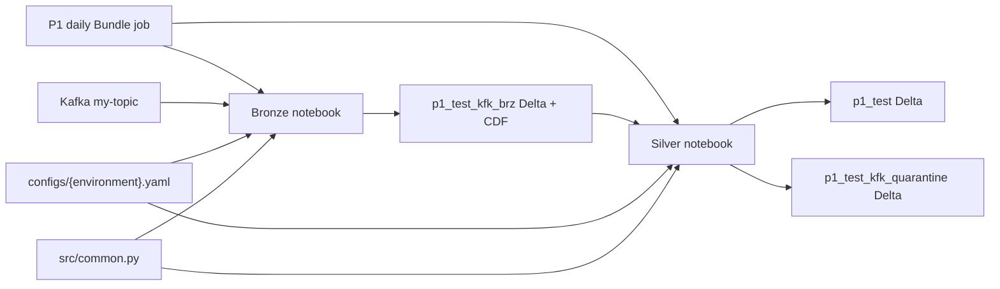
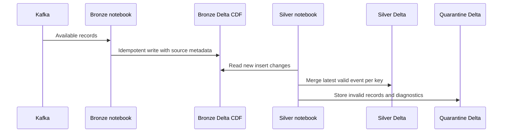

# System Architecture

## System Overview

P1 is a batch-triggered streaming data pipeline implemented as two Databricks notebooks and one scheduled Declarative Automation Bundle job. It reads Kafka, writes bronze Delta records, then consumes bronze Change Data Feed to update silver and quarantine tables.

## Architecture Diagram

## Component Descriptions

### Bronze notebook — `notebooks/P1/bronze/bronze_ingestion.py`
- **Purpose**: Incrementally ingest Kafka records into bronze.
- **Responsibilities**: Read Kafka with SASL_SSL/PLAIN, retrieve the password from Databricks Secrets, persist offsets through a stable checkpoint, merge by Kafka identity, and enable CDF.
- **Dependencies**: Spark Structured Streaming, Delta Lake, Databricks `dbutils`, `src.common`, and environment configuration.
- **Type**: Application notebook.

### Silver notebook — `notebooks/P1/silver/silver_processing.py`
- **Purpose**: Process inserted bronze CDF rows into silver and quarantine.
- **Responsibilities**: Parse JSON into VARIANT attributes, validate keys, retain latest rows by source timestamp and Kafka partition/offset, quarantine invalid rows, and checkpoint the CDF stream.
- **Dependencies**: Spark, Delta Lake, Databricks `dbutils`, `src.common`, and bronze CDF.
- **Type**: Application notebook.

### P1 job — `jobs/P1/`
- **Purpose**: Schedule and order notebook execution.
- **Responsibilities**: Daily schedule, shared cluster, environment parameter, concurrency/queueing, retries, and bronze-before-silver dependency.
- **Dependencies**: Databricks Workflows and deployment-supplied Bundle variables.
- **Type**: Deployment configuration.

## Data Flow

## Integration Points

- **External APIs**: None identified.
- **Databases**: Delta tables `test_prod.p1_test_kfk_brz`, `test_prod.p1_test`, and `test_prod.p1_test_kfk_quarantine` as configured by the current production YAML.
- **Third-party Services**: Kafka topic `my-topic`; Databricks Secrets for password lookup; S3 for checkpoint and data paths.

## Infrastructure Components

- **Databricks Jobs**: One daily P1 Bundle job with ordered bronze and silver tasks.
- **Storage**: S3 path from environment config, including stable streaming checkpoints.
- **Networking / Identity**: Deployment-owned workspace, cluster policy, service principal, Kafka permissions, and Delta/S3 grants; runtime validation has not occurred.
