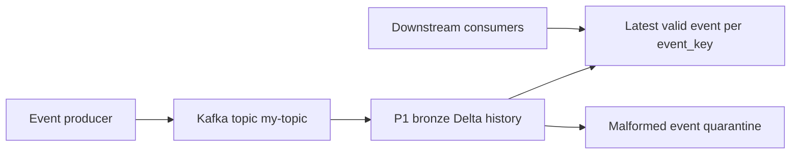

# Business Overview

## Business Context Diagram

## Business Description

- **Business Description**: P1 lands Kafka events in a traceable raw layer, isolates records that cannot be processed, and exposes the latest valid event for each business key in a structured silver table.
- **Business Transactions**:
  - Daily incremental ingestion of available Kafka events into bronze.
  - Validation and consolidation of new bronze events into silver.
  - Isolation of malformed events in quarantine for diagnosis.
- **Business Dictionary**:
  - **Source event time**: Timestamp supplied by Kafka and stored as `source_timestamp`.
  - **Ingestion time**: Time a workload processes or persists a record; distinct from Kafka source time. Quarantine currently stores `ingestion_timestamp`; bronze and silver do not.
  - **Event key**: `event_key`, the key by which silver retains one latest event.

## Component Level Business Descriptions

### P1 Bronze Ingestion
- **Purpose**: Capture Kafka records and preserve payload and source metadata.
- **Responsibilities**: Incremental reads, checkpointed progress, idempotent writes, and CDF availability for silver.

### P1 Silver Processing
- **Purpose**: Make valid events queryable by business key and separate invalid records.
- **Responsibilities**: Parse JSON, validate `event_key`, merge latest valid records into silver, and write invalid records to quarantine.
