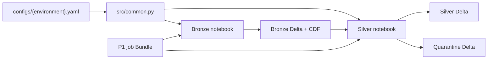

# Dependencies

## Internal Dependencies

### Bronze notebook depends on shared configuration
- **Type**: Runtime.
- **Reason**: Resolves the selected environment, Kafka settings, database, and checkpoint path.

### Silver notebook depends on bronze Delta CDF
- **Type**: Runtime/data contract.
- **Reason**: Consumes insert changes from the bronze table and relies on CDF/history availability.

### Silver and quarantine tables depend on a common bronze source identity
- **Type**: Data contract.
- **Reason**: `(topic, partition, offset)` supports deduplication and replay safety.

## External Dependencies

- **Kafka source connector** — Spark Kafka source and the Databricks Kafka runtime dependency.
- **Delta Lake** — transaction log, merges, CDF, and `VARIANT` column support.
- **Databricks runtime services** — job orchestration, widgets, `dbutils.secrets`, and job compute.
- **S3** — persistent data and streaming checkpoints.
- **PyYAML** — parsing environment-specific YAML.
