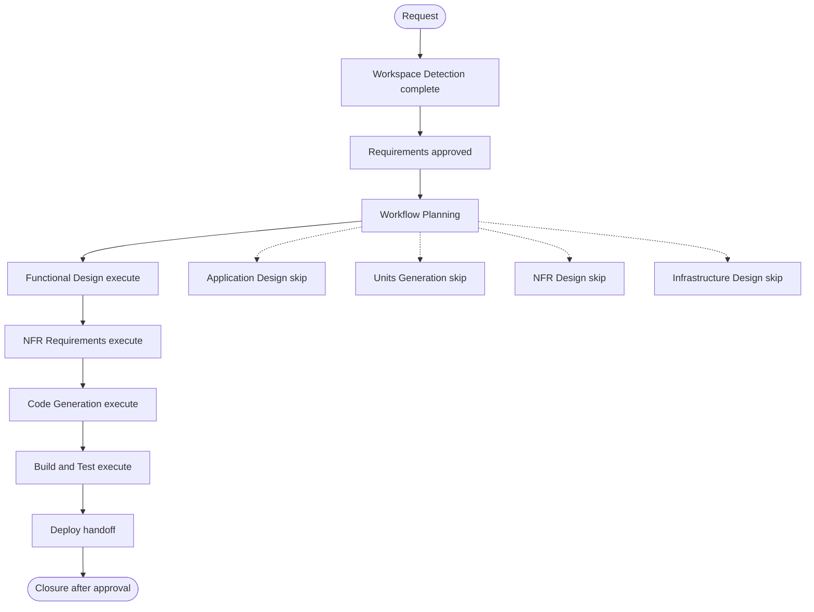

# Execution Plan: P1 Streaming Lookback

## Approved requirements

Requirements were approved by the user with “Approve & Continue”. The agreed behavior is documented in `aidlc-docs/current/inception/requirements/p1-streaming-lookback-requirements.md`.

## Detailed Analysis Summary

### Transformation Scope

- **Transformation type**: Enhancement to an existing Databricks workload.
- **Primary changes**: Add independent `lookback_days` widgets to bronze and silver; reset the associated checkpoint for positive values; start the streams at source-native timestamps; report the effective replay window.
- **Related components**: Bronze and silver notebooks, P1 Bundle job parameters, active requirements/design/handoff documents, and P1 canonical workload knowledge.

### Change Impact Assessment

- **User-facing changes**: Yes — operators can initiate a layer-specific replay with a widget value.
- **Structural changes**: No new component or service.
- **Data model changes**: No schema change. Existing identity-based merges must remain idempotent during replay.
- **API changes**: No external API. Notebook task parameters are exposed through the Bundle job definition.
- **NFR impact**: Positive lookbacks may process retained source history and require sufficient Kafka, CDF, and checkpoint storage access. The selected lookback may exceed available retention; the notebook must report the effective shorter window.

### Component Relationships

```text
P1 daily job
  -> Bronze task: lookback_days -> Kafka timestamp cutoff -> bronze checkpoint -> bronze Delta/CDF
  -> Silver task: lookback_days -> bronze CDF commit cutoff -> silver checkpoint -> silver/quarantine Delta
```

The job runs bronze before silver. The two lookback controls remain independent; an end-to-end replay uses matching values.

### Risk Assessment

- **Risk level**: Medium — checkpoint reset causes replay and can consume substantial source and compute capacity.
- **Rollback complexity**: Moderate — output tables remain protected by current idempotent merge keys, but a reset checkpoint cannot restore the prior stream offset state. Normal runs resume from the newly advanced checkpoint.
- **Verification complexity**: Moderate — local static inspection cannot prove Kafka timestamp selection, CDF retention behavior, or checkpoint reset behavior in Databricks.

## Workflow Visualization



Text alternative: Workspace Detection -> Requirements Analysis -> Workflow Planning -> Functional Design -> NFR Requirements -> Code Generation -> Build and Test -> Deploy -> closure. Application Design, Units Generation, NFR Design, and Infrastructure Design are skipped.

## Phases to Execute

### Inception

- [x] Workspace Detection and existing workload inspection.
- [x] Requirements Analysis; answers recorded and approved.
- [x] Workflow Planning.
- [x] User Stories — skip; this is an operator-facing control within an existing internal workload.
- [ ] Application Design — **SKIP**; no new component, service, or boundary is introduced.
- [ ] Units Generation — **SKIP**; both notebooks and their shared job already form one established P1 workload.

### Construction

- [x] Functional Design — **EXECUTE**; approved by user; defines checkpoint reset ordering, timestamp option behavior, replay idempotence, retention fallback, and run reporting across both layers.
- [x] NFR Requirements — **EXECUTE**; approved by user; covers replay volume, retention constraints, checkpoint permissions, and operator-visible logging.
- [ ] NFR Design — **SKIP**; existing Databricks, Kafka, Delta, and Bundle patterns are retained; no new NFR architecture is required.
- [ ] Infrastructure Design — **SKIP**; no infrastructure resource is added. The existing job definition will expose the two independent widget parameters.
- [x] Code Generation — **EXECUTE**; code generation and static review completed; user approved continuation with “Continue to Next Stage”.
- [x] Build and Test — **EXECUTE** as a workflow stage; results documented and the user accepted the verification limitation. Automated tests, Bundle validation, and Databricks runtime checks were not run; runtime behavior remains unverified.

### Deploy

- [ ] Deploy — **EXECUTE**; prepare `pr_request.md` and ordered `deploy_instructions.md` because the Bundle job definition and notebook behavior require deployment and an operator-selected replay run.

## Change Sequence

1. Complete Functional Design and NFR Requirements; resolve exact replay/window logging and checkpoint reset details.
2. Prepare and approve the Code Generation plan.
3. Update notebook widgets and stream source options, preserving Google-style docstrings and the six-cell notebook structure.
4. Expose `bronze_lookback_days` and `silver_lookback_days` independently in `jobs/P1/resources/p1-daily-pipeline.yml`, defaulting both to `0`.
5. Update canonical P1 workload guidance and intent artifacts.
6. Complete Build and Test reporting with Databricks runtime limitations explicit; prepare Deploy handoff.

## Verification Approach

- Review notebook cell ordering, widget validation, cutoff calculation, checkpoint-reset sequencing, stream options, and idempotent target merges.
- Review Bundle YAML structure and parameter mapping statically.
- Do not execute against Kafka, Delta tables, S3 checkpoints, a Databricks job, or production.
- Do not add or run automated tests unless the user requests test execution. Report all unverified Databricks behavior clearly.

## Success Criteria

- A zero value resumes each existing checkpoint; a positive value resets and starts that notebook from its agreed source-time cutoff.
- Bronze and silver controls can be run independently or with matching values for a full replay.
- Expired source history is handled from the earliest available point and the shortened effective window is reported.
- Existing table merge keys prevent duplicate replay from creating duplicate business/source identities.
- Job parameters default to `0`, and release instructions state that larger values trigger replay and can increase processing volume.

## Review Status

Workflow plan approved by the user with “Approve & Continue” on 2026-09-25. Code Generation and Build and Test reporting were approved with “Approve & Continue” on 2026-09-25; the verification limitation was accepted. Deploy handoff artifacts are prepared and awaiting user review.
