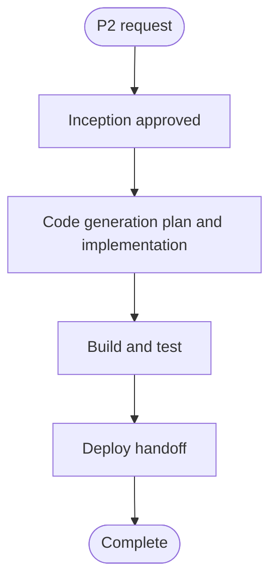

# Execution Plan: P2 Databricks Pipeline

## Analysis Summary

- **Transformation scope**: Add one parallel Databricks subproject based on P1; no change to the shared architecture or P1 behavior.
- **Primary changes**: Copy P1 job bundle, job resource, and bronze and silver notebooks into P2 locations. Add the P2 topic override `my-test-p2` to shared `configs/prod.yaml` and use P2-specific identifiers and state paths.
- **Impact**: No public API, schema behavior, or processing rule change. New P2 tables and checkpoint paths isolate persisted pipeline state. The P2 job will have a schedule equivalent to P1.
- **Component relationships**: P2 job runs P2 bronze ingestion, then P2 silver processing; P2 bronze Delta/CDF is the handoff. Both use the shared production config and shared project utilities.
- **Risk**: Medium. A cloned scheduled job can increase workload and storage use. Correctly separating tables and checkpoints is essential. Runtime deployment values and operational owner are deployment-provided.
- **Coordination**: Sequential construction: config and notebook copies first, bundle resources after their paths are established, then static consistency review and tests.

## Workflow Visualization

Text flow: approved requirements and plan → P2 artifact implementation → Build & Test → PR and deployment handoff.

## Stages

### Inception

- [x] Workspace Detection — brownfield P1 workload found.
- [x] Reverse Engineering — scoped P1 workload review approved.
- [x] Requirements Analysis — approved; topic and P2 isolation requirements are explicit.
- [x] User Stories — SKIP. This is an internal data pipeline with no user-facing workflow or distinct persona.
- [x] Workflow Planning — revised plan approved by user.
- [ ] Application Design — SKIP. P2 follows existing P1 component boundaries and contracts.
- [ ] Units Generation — SKIP. This is a small, direct copy of one job and its two notebooks/config.

### Construction

- [ ] Functional Design — EXECUTE concisely. Reuse approved P1 U1/U2/U3 designs, adapt project-owned tables/checkpoints, and identify relevant pure functions for partial PBT.
- [ ] NFR Requirements — EXECUTE narrowly for PBT-09 framework selection and development dependency decision; other P1 NFRs are reused.
- [ ] NFR Design — SKIP; no new architecture or quality pattern is introduced.
- [ ] Infrastructure Design — SKIP; the same Databricks bundle resource types and deployment-provided variables are reused.
- [ ] Code Generation — EXECUTE. First prepare a detailed code-generation checklist and obtain approval, then create P2 artifacts.
- [ ] Build & Test — EXECUTE. Review copied identifiers/configuration and run applicable repository checks after implementation. Report static, Python, YAML/bundle, and runtime verification separately.

### Deploy

- [ ] Deploy handoff — EXECUTE. Prepare a PR request and deployment instructions for adding the P2 bundle/job. Do not deploy or run the job.

## Implementation Sequence

1. Keep `configs/prod.yaml` shared. Preserve `kafka.topic` for P1 and add `kafka.topics_by_project.P2: my-test-p2`; P2 uses the same `prod` environment profile and shared Kafka settings.
2. Copy P1 bronze and silver notebooks under `notebooks/P2/`; preserve processing logic while changing project references, table names, and checkpoint paths to P2-owned identifiers.
3. Copy the P1 bundle and job resource under `jobs/P2/`; update bundle/job/cluster identifiers, notebook paths, and P2 descriptions while preserving schedule, parameters, dependencies, run-as, compute variables, and retry behavior.
4. Add the NFR-approved Hypothesis dependency, a property test for the copied pure helper, and a Jenkins unittest stage.
5. Review that P2 paths resolve, both notebooks select P2 configuration, P2 does not share P1 table/checkpoint names, and P1 files are unchanged.
6. Run approved Build & Test checks; identify any Databricks, Kafka, or storage validation that cannot be run locally.

## Plan Amendment: Partial PBT Requirements

The user selected partial property-based testing. Its enforced rules include PBT-09, which requires choosing a framework and documenting it with development dependencies. NFR Requirements depends on Functional Design, so both stages are added in a narrow scope: document the copied P1 component contracts and P2 state names, then select the PBT framework and any required development dependency. Other NFR design stages remain skipped because P1's deployment and runtime design are reused.

## Quality and Extension Checks

- Follow repository notebook cell order, Google-style docstrings, Black, and Ruff conventions.
- Partial PBT enforcement applies to PBT-02, PBT-03, PBT-07, PBT-08, and PBT-09. Assess whether changed/extracted pure functions or serialization paths warrant generated tests; mark rules N/A with a reason when no applicable property/framework requirement exists. PBT-01 and other rules are advisory in partial mode.
- Security and resiliency extensions are disabled by user choice.

- Partial PBT is implemented for the approved pure helper scope with Hypothesis, reproducible generated inputs, shrinking, and CI execution.

## Success Criteria

- P2 reads only `my-test-p2` while preserving P1's pipeline behavior.
- P2 job, config, notebooks, tables, and checkpoints are separately named and do not collide with P1.
- P1 artifacts remain unchanged.
- P2 bundle and notebook paths are internally consistent; available checks pass or limitations are recorded accurately.
- Deploy handoff describes the bundle deployment and required deployment-provided variables without executing deployment.
