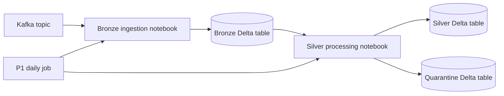

# System Architecture

## System Overview

P1 is a Databricks bundle with a scheduled job, two notebooks, environment configuration, Kafka as its input, and Delta tables/checkpoints as persistent state.

## Architecture Diagram

## Components and Data Flow

- `jobs/P1/`: Databricks bundle and sequential daily job definition.
- `notebooks/P1/bronze/`: Kafka source ingestion into bronze Delta.
- `notebooks/P1/silver/`: Delta CDF processing into silver and quarantine.
- `configs/prod.yaml`: environment-specific database, storage, and Kafka settings.
- `src/`: shared configuration/schema utilities.
- The job starts silver only after bronze succeeds; the notebooks use separate checkpoints.

## Integration Points

- Kafka supplies the configured source topic.
- Databricks Secrets provide Kafka credentials at runtime.
- Delta tables and checkpoint storage persist pipeline state.
- The bundle deploys the Databricks job and syncs notebooks/configuration.
